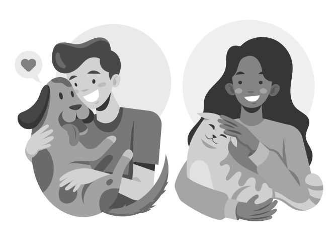
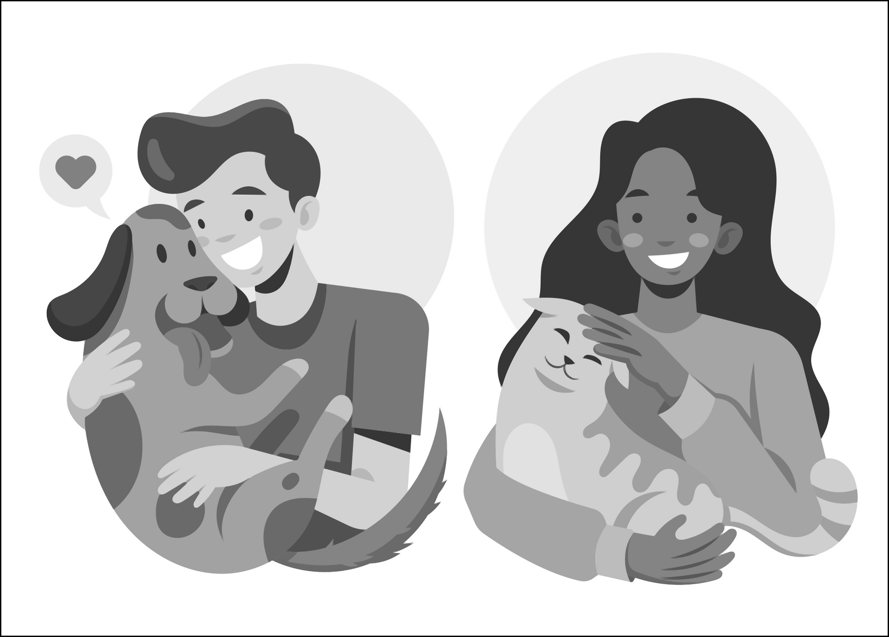

# Hey there!

I'm adding this README after the due date, but I thought it might be nice for you to know what's going on around here. So let me give you the tour:

## Structure

- data - This is the where the `.npy` data is for training and testing the models. It has two versions, the 5x5 data and the 3x3. The only difference is that the 5x5 has a larger input window.
- freepik_images - This is where all the data comes from. It has the original svgs from freepik, it has my modified versions, the large pngs that I made from my versions, and finally the shrunk versions. I made `small_pngs_2` before I was sure what factor I wanted to upscale the images.
- info - This has some pictures that I was using when I wrote the proposal and report. You can ignore them.
- models - There are three model types here. The fake one (which is just a simple algorithm), the 3x3, and the 5x5 (referring to the input window size). Both model types have several saved models under them, along with a `stats` file which reports how the model performed.
- Produce_test_data - Contains the scripts that took the large and small images from `/freepik_images` and generated the test data.

Great, but I haven't actually explained most of the scripts. Most of them were written with help from Claude. The less important the script, the less involved I was in the writing of that script.

## Scripts

- `data/kis_model_3x3/visualize_data.py` - This script doesn't matter, so I barely looked over it at all. I just wanted to make sure that the test data looked how I expected, so I had Claude write up this script to visualize the data.
- `freepik_images/shrink_large_pngs.py` - This script takes pngs from `/large_pngs` and scales them down by a factor of 3 (or two, but I ended up not using that).
- `Produce_test_data/kis_data_generation_3x3.py` (and the `5x5` one) - Takes the large and small images from `/freepik_images` and generated the test data.
- `models/<model>/train_model.py` - Does exactly what you think it does.
- `models/<model>/upscale_image.py` - This is what it's all about. It opens an image from the location provided, and upscales it by a factor of three. It currently does it for all 3 color channels, which is 3x as slow as it needs to be for gray images.

## Libraries used

- torch
- cv2
- numpy
- matplotlib (but only for the data visualizing script that doesn't really matter)

## Results

I include results in my paper, but it might be easier to see the quality difference here.

### Example

#### Original Image

#### Shrunk by a factor of 3

#### 3x3 window ANN Result

#### 5x5 window ANN Result

